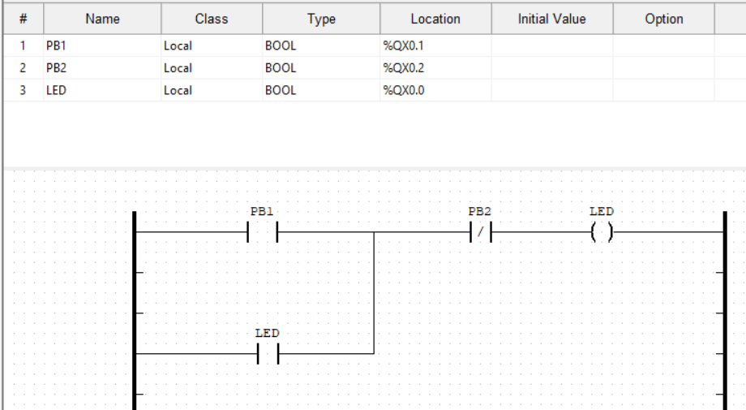

# ICS/OT projects and self study

In this README.md file you are going to find all my notes of my self study projects
that allowed me to learn more about ICS/OT Security.  
The following things are integrated in this file:  
- WebAPP-OT project
- Replay Attack
- Other-scripts

---

## Table of Contents

- [General explanation of used protocols](#Used-devices-and-technologies)
- [WebAPP-OT project](#WebAPP-OT-project)
- [Section Two](#section-two)

---

## Used devices and technologies
The lab that was created for these projects runs completely on a Raspberry Pi. The raspberry PI
has OpenPLC installed which simulates a production environment. That raspberry Pi has some LED, Servo Motor 
and push buttons connected to the GPIO ports. A more detailed setup will be described in the projects.

The lab was based on a production environment that has a PLC and an HMI. The HMI is simulated with a webserver that runs 
on the host (in this case my PC, but it could be a virtual machine or another server).  
Communication between the 2 devices is completely based on MODBUS. More information can about the MODBUS protocol 
can be found here (inser link naar wiki met modbus doc)

---

## WebAPP-OT project

This project is specify development to see how easy an MODBUS connection is established and
how easy it is to manipulate it.
The project has 2 main components:
- The hardware setup => OpenPLC program and wiring
- The python files

### The hardware setup
Like said before the hardware setup has 2 main components.  
These are the OpenPLC program and the actual wiring.

#### OpenPLC program
The used program for this project is a simple start stop mechanism.
A more detailed explantation of the program can be found in the wiki.

The wiring is as follows:

---

## Section Two

Here is some text for the second section.
