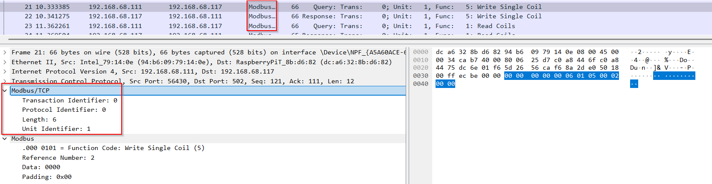
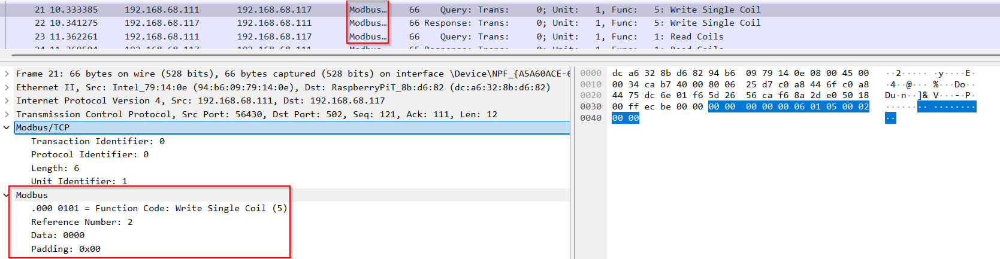
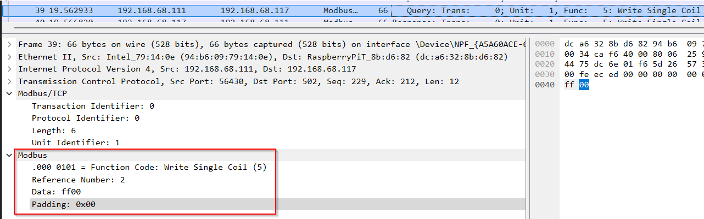

# Modbus Protocol - Working

---

## What is Modbus TCP/IP?

Modbus TCP/IP is a version of the Modbus protocol that runs over Ethernet using the TCP/IP stack, specifically over TCP port 502.  
It is used for **communication between devices** like PLCs, HMIs, and SCADA systems.

---

## Protocol Stack Overview

Modbus TCP/IP fits into the OSI model like this:

| Layer             | Protocol                    |
|------------------|-----------------------------|
| 7 (Application)   | Modbus Application Protocol |
| 4 (Transport)     | TCP                         |
| 3 (Network)       | IP                          |
| 2 (Data Link)     | Ethernet (MAC)              |

---

## Protocol Breakdown

Below you’ll find how the protocol works.

### MBAP Header (Modbus Application Protocol Header)

7 bytes total, and always comes before the actual Modbus Protocol Data Unit (PDU):

| Field          | Bytes | Description                                                   |
|----------------|--------|---------------------------------------------------------------|
| Transaction ID | 2      | Set by the client to match request/response. Server echoes it |
| Protocol ID    | 2      | Always `0x0000` for Modbus TCP                                |
| Length         | 2      | Number of remaining bytes (Unit ID + Function Code + Data)    |
| Unit ID        | 1      | Slave address (or ignored in pure TCP/IP)                     |

---

## Modbus Function Codes & Structure (PDU)

These are common function codes and their request/response structure:

| Function               | Code  | Request Format                           | Response Format                        |
|------------------------|-------|------------------------------------------|----------------------------------------|
| Read Coils             | 0x01  | Start Addr (2B), Quantity (2B)           | Byte Count (1B), Coil Status (N)       |
| Read Discrete Inputs   | 0x02  | Same                                     | Same                                   |
| Read Holding Registers | 0x03  | Start Addr (2B), Quantity (2B)           | Byte Count (1B), Register Values (N×2B)|
| Write Single Coil      | 0x05  | Coil Addr (2B), Value (0xFF00/0x0000)    | Echo request                            |
| Write Single Register  | 0x06  | Register Addr (2B), Value (2B)           | Echo request                            |
| Write Multiple Registers | 0x10| Start Addr (2B), Quantity (2B), Byte Count (1B), Values (N×2B) | Addr + Quantity |

> **Note:**  
Start Addr (2B) = the start address is 2 bytes (16 bits), allowing range `0 - 65535` (`0x0000 - 0xFFFF`)

Why 2 bytes?
- Modbus supports 65536 addresses.
- Needed for: Coil, Input, and Register addresses.

---

## Example: Read Coils (Function Code `0x01`)

**Request Frame Structure:**

| Field           | Length     | Example (Hex) | Meaning            |
|------------------|------------|----------------|---------------------|
| Function Code    | 1 byte     | `01`           | Read Coils          |
| Start Address    | 2 bytes    | `00 13`        | Start at coil 19    |
| Quantity of Coils| 2 bytes    | `00 0A`        | Read 10 coils       |

**Full PDU:**   
01 00 13 00 0A
	• 01: Read Coils
	• 00 13: Start Address = 19
	• 00 0A: Quantity = 10

***In Wireshark:***  
Example 1 => write OFF (Data: 0000)

=> FOTO

Example 2 => wite ON (Data: ff00)

=> FOTO

#### PDU (Protocol Data Unit):

| Field               | Value    | Bytes (Hex) | Notes                      |
|---------------------|----------|--------------|-----------------------------|
| Function Code       | `0x01`   | `01`         | Read Coils                 |
| Start Address       | `0x0000` | `00 00`      | Coil 1 = Address 0         |
| Quantity of Coils   | `0x0008` | `00 08`      | Read 8 coils               |

### Summary:

This packet is sending:  
**Write coil #2 to OFF (0)**

### In Modbus terms:
- **Function Code 0x05**: Write Single Coil  
- **Coil Address**: 2 (can control a relay, digital output, etc.)  
- **Data Value**:  
  - `0xFF00` = ON (true)  
  - `0x0000` = OFF (false)

---

## Final Example — Full Modbus TCP Request

### Goal:
- **Function**: Read Coils (`0x01`)  
- **Start Address**: Coil 1 (Modbus addresses start at 0, so this is address `0x0000`)  
- **Quantity**: Read 8 coils

---

### Modbus TCP Frame = MBAP Header (7 bytes) + PDU

#### MBAP Header:

| Field             | Value | Bytes (Hex) | Notes                     |
|------------------|--------|--------------|----------------------------|
| Transaction ID    | 0      | `00 01`      | Client-side identifier     |
| Protocol ID       | 0      | `00 00`      | Always 0 for Modbus TCP    |
| Length            | 6      | `00 06`      | Bytes to follow (Unit ID + PDU) |
| Unit Identifier   | 1      | `01`         | Slave address or Unit ID   |

**MBAP Hex**: 00 01 00 00 00 06 01

### PDU (Protocol Data Unit: Function Code + Data)

| Field              | Value     | Bytes (Hex) | Notes                          |
|-------------------|-----------|-------------|--------------------------------|
| Function Code     | 0x01      | `01`        | Read Coils                     |
| Start Address     | 0x0000    | `00 00`     | Coil 1 = Address 0             |
| Quantity of Coils | 0x0008    | `00 08`     | Read 8 coils                   |

**PDU Hex:**  
`01 00 00 00 08`

---

### Final Modbus TCP Request in Hex

00 01 00 00 00 06 01 01 00 00 00 08

Split up by meaning  
**[00 01]** Transaction ID  
**[00 00]** Protocol ID  
**[00 06]** Length  
**[01]**    Unit ID  
**[01]**    Function Code: Read Coils  
**[00 00]** Start Addr = Coil 1 (address 0)  
**[00 08]** Quantity = 8 coils  

